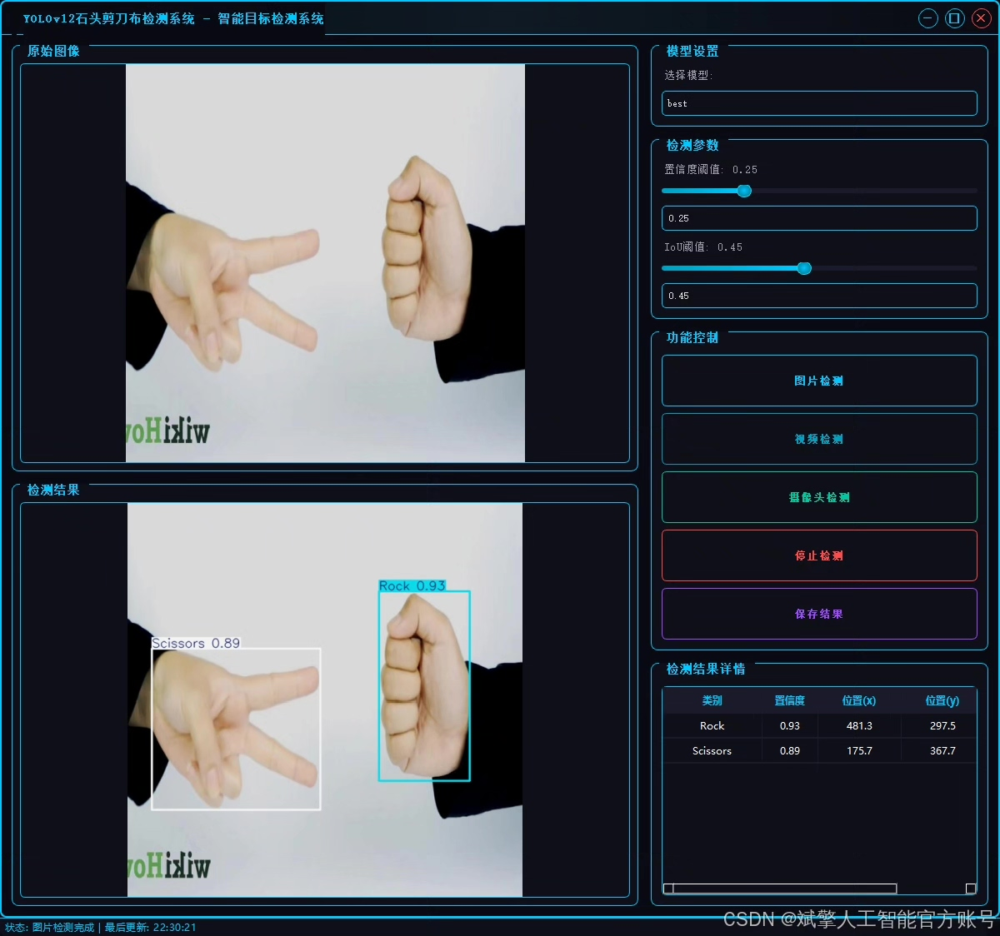
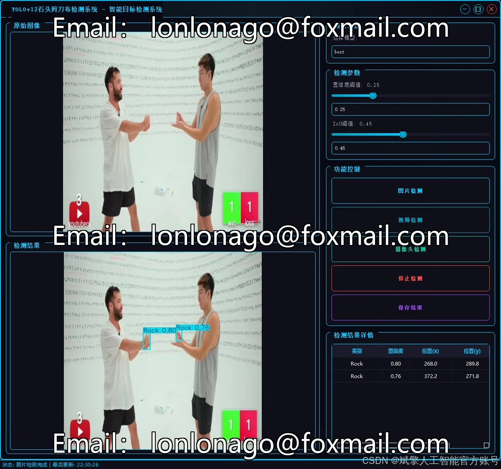
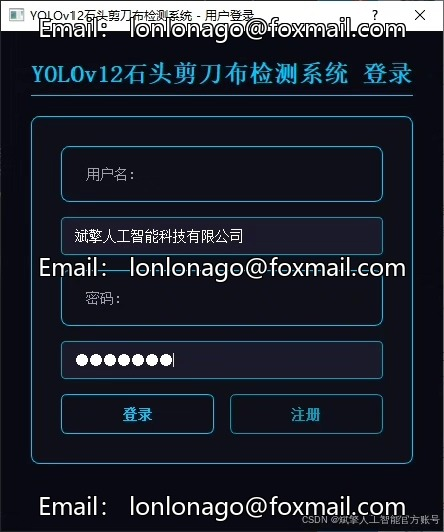
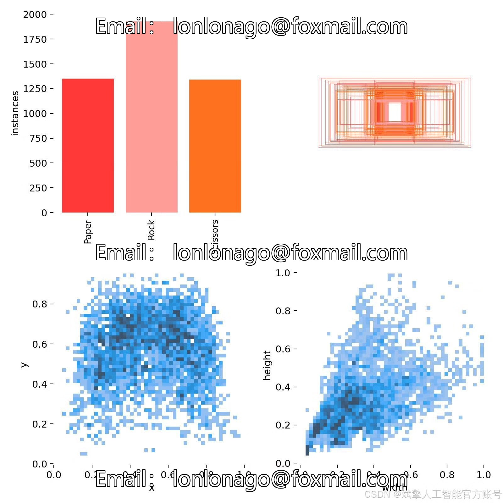
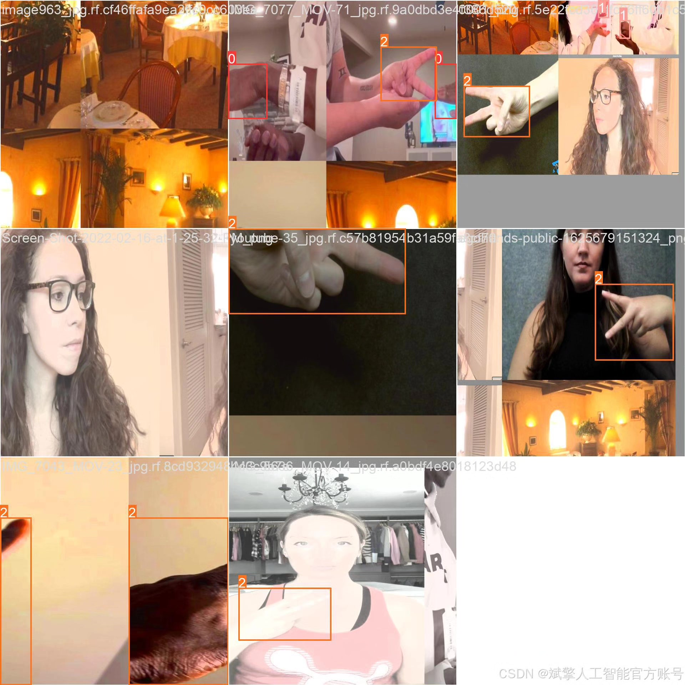
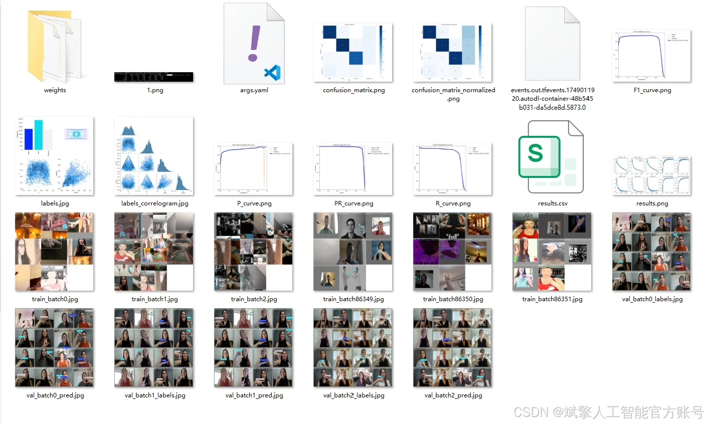
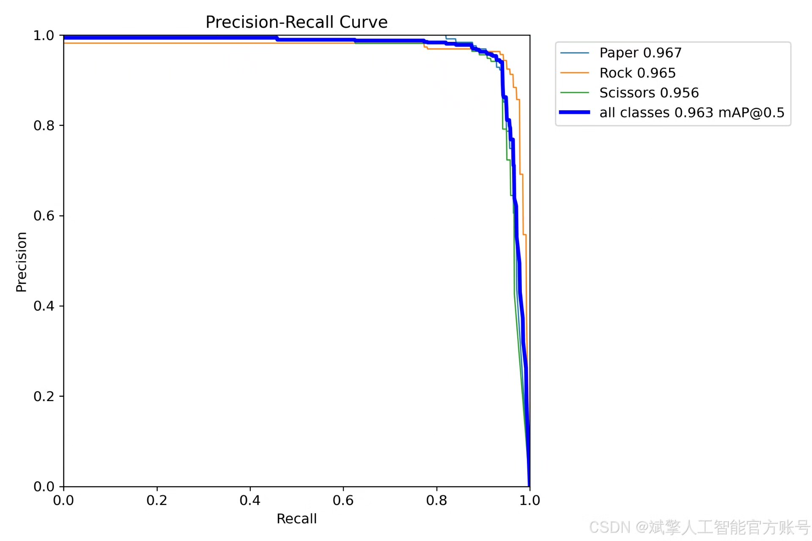
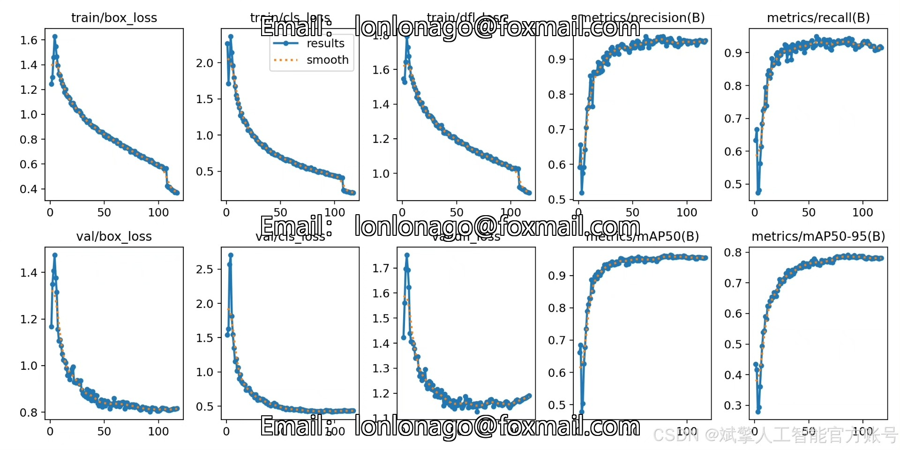
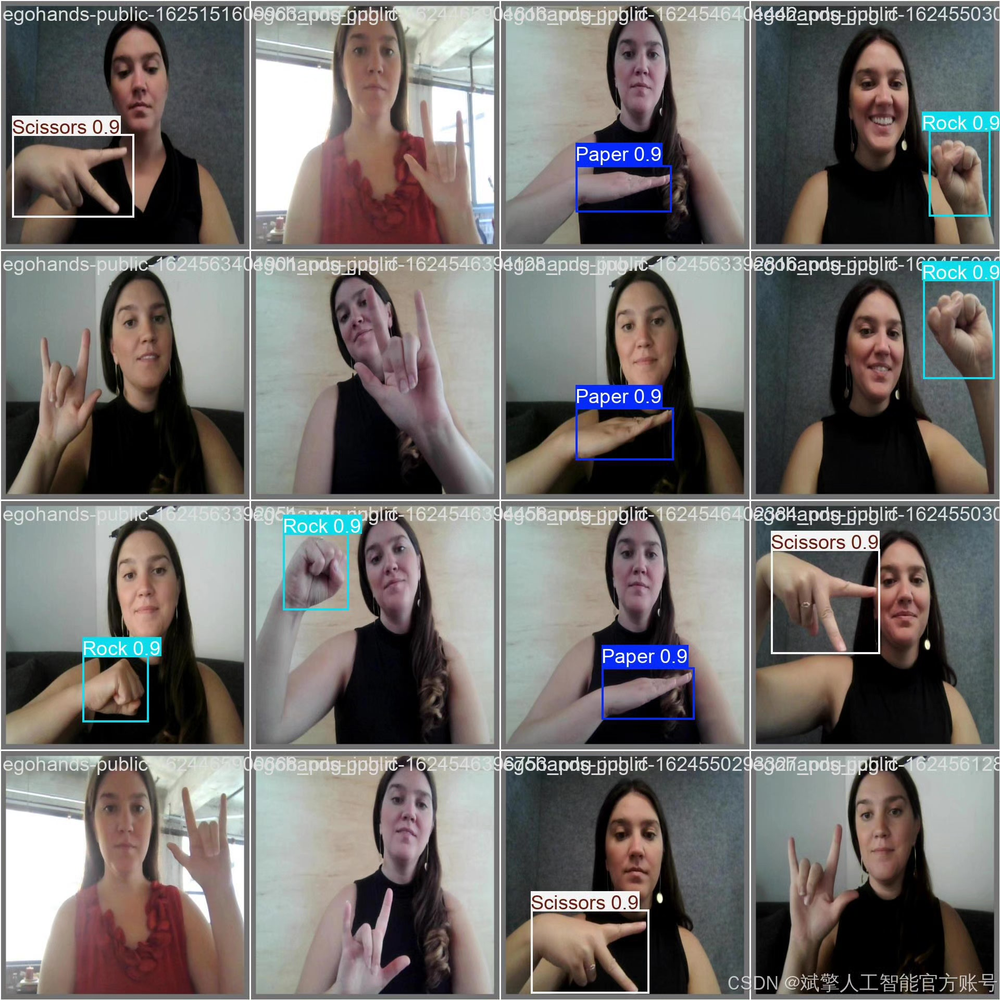

# YOLOv12 Gesture Recognition System

## Body

YOLOv12 Gesture Recognition System Based on Deep Learning YOLOv12: A Sliding Scale Rock Paper Scissors Recognition and Detection System (YOLOv12+YOLO dataset + UI interface + login registration interface + Python project source code + model)

This paper proposes a gesture recognition system based on the deep learning target detection model YOLOv12 for the game of rock, paper, scissors. It can detect and classify user gestures (rock, scissors, paper) in real-time. The system uses the YOLOv12 model for efficient target detection and combines it with a custom YOLO format dataset for training. The dataset includes 6,455 images for the training set, 576 for the validation set, and 304 for the test set, covering a variety of gesture scenarios. Additionally, the system has a user-friendly UI interface that supports login and registration functions, enhancing the interaction experience. Experimental results show that the system exhibits high detection accuracy and real-time performance on the test set, verifying the effectiveness of YOLOv12 in gesture recognition tasks.

✅ User Login and Registration: Supports password verification and security validation.
✅ Three detection modes: Based on the YOLOv12 model, supporting image, video, and real-time camera detection, accurately recognizing targets.
✅ Dual-screen comparison: Displaying the original image and detection result simultaneously on the screen.
✅ Data visualization: Real-time table displaying the category, confidence, and coordinates of detected targets.
✅ Intelligent parameter adjustment: Offers a confidence slide bar to dynamically optimize detection accuracy, adapting to different scene requirements.
✅ Sci-fi style interactive interface: Dark theme combined with dynamic light effects to reduce visual fatigue and enhance operational experience.

## Images

## Payment

Here is a pay link on Stripe ( https://buy.stripe.com/3cs8yP7sY87d0vu9AB ). Please contact me lonlonago@foxmail.com after funding $89, and I will send you a complete data files , thank you!

